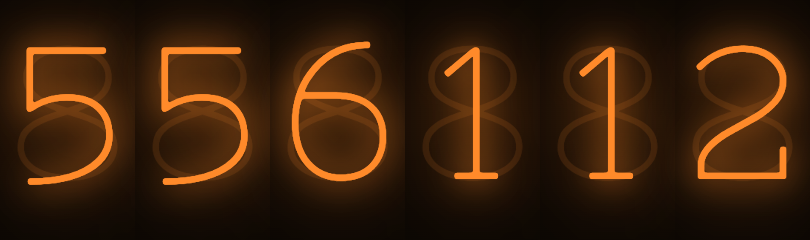
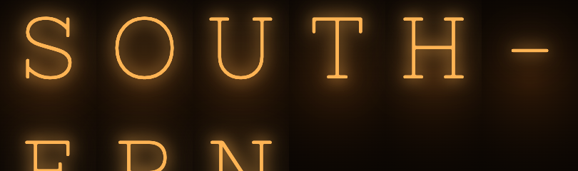
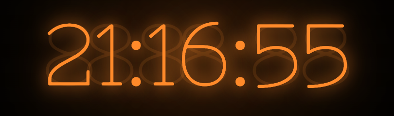
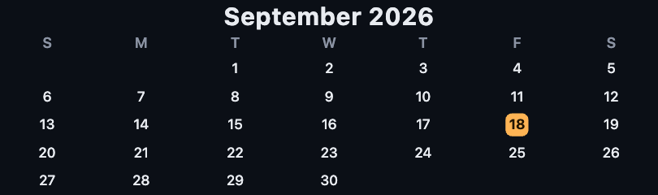
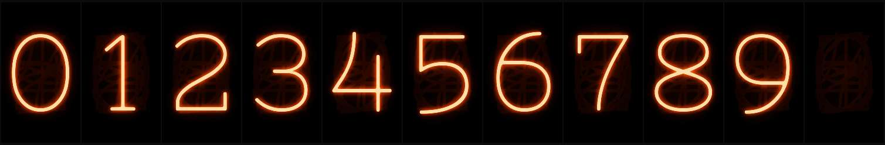

# ESPTube Clock — SI HAI IPS tube clock, revived with custom firmware

A gifted ESP32 "IPS nixie" tube clock with broken stock firmware, reverse-engineered and
rebuilt: custom firmware that drives the displays + an HTTP REST API, a local WYSIWYG web
console for pushing arbitrary content and animations, and full standalone button control.
Documented end-to-end for a Quarto write-up (diligentservices.io).

## Gallery

The clock's own faces — the **real nixie glyph set** (cathode-wire glyphs, neon bloom, ghost
cathodes, per-tube warm glass), drawn by the firmware and mirrored pixel-for-pixel by the built-in
web console's renderer:

| | |
|:---:|:---:|
| <br>**Nixie clock** | <br>**Date** |
| <br>**Scrolling marquee** | <br>**Vertical marquee** (hyphenated, scrolls down) |
| <br>**Big clock** | <br>**Countdown timer** |
| <br>**Month calendar** | <br>**Per-tube control / swap** |
| <br>**Pong** — across the tubes | <br>**Newspaper** — a headline across the screen |
| <br>**Newspaper, per tube** — a headline card on each | |

Text runs on the device's **native nixie engine** (zero pixels streamed); graphics like pong and the
per-tube swap push pixels. A built-in web console drives it all — scenes, timed **shows**, and a live
**API reference** (try any REST call, copy the curl).

## Status: complete & working ✅

- **Hardware:** SI HAI IPS Clock — ESP32-WROOM-32D (16 MB), 6× ST7789 135×240 IPS panels on a
  **74HC595 shift-register** chip-select, per-tube WS2812 underglow, 4 buttons, DS1302 RTC.
- **Runs the clock** (NTP, America/Los_Angeles), takes commands over HTTP, and is drivable with
  **no computer at all** via the physical buttons.
- Current layout: 5 working tubes; **index 0 = far right … 5 = far left**; slot 0 (far right)
  empty (`populated_mask 0x3E`). Display index `i` and glow-LED index `i` are the same glass.

## Start here

```bash
python3 tools/console.py <clock-ip>     # the console at http://localhost:8765 — camera / screen capture work here
```
(The clock also hosts the console at `http://<clock>/helper`; capture does not work there — browsers only
allow it on `localhost`, `file://` or https. Details: `docs/GUIDE.md` §14.)

**One way to do each thing.** 🧹 *Stop & clear* (Esc) stops everything that paints the tubes and cancels
frames already on their way. 🕯️ *Clock face* does the same and shows the clock. ⌘K lists every action.
Panels drag by their titles, snap, collapse and hide; the arrangement is saved. Every pixel goes through
one pipeline (latest wins per tube, only changed 16-row blocks, lossless), over the **USB cable** when it
is connected (1.5 Mbaud CRC-checked datagrams ≈ 119 KB/s) or WiFi. 🧊 *Stage* shows the whole display in
3-D and stores where each tube physically is; export to USD/USDZ.

## Two ways to drive it

**1 — The web console (rich):** open **[`tools/helper.html`](tools/helper.html)** in a browser on
the same WiFi (type the clock's IP, hit Connect). Per-tube widgets — **Text · Colour · Picture ·
Weather** (open-meteo → met.no → wttr.in, whichever answers) **· 📶 Signal** (the clock's WiFi, ping/cast speed, internet Mbps) **· Clock** (time, **Date / mini-calendar**, or single value; plain or **Nixie glow**) **·
Ticker** (crypto / stocks / weather / JSON) **· Custom** — a **spanning canvas** (all tubes as one
wide display), an **animation studio** (marquee, big clock/countdown, **month calendar**, progress,
sparkline, ticker, news, LED waves, matrix, starfield, plasma, slot-roll, alerts), a **scene
manager** with **save / load / edit + cycling** (including the clock's own **🎭 device faces** as
scenes, so a rotation can hand back to the nixie), and JSON **backup/restore**. In spanning mode you
can **✋ drag a picture across the tubes** (scroll to zoom, live-pushed, with a **seam-gap** setting so
the image lines up on the glass). The UI is **glyph-labelled** throughout (kid- and
non-English-friendly). All client-side over REST — no flashing. Content lives in IndexedDB, divorced
from the device's limits. Choosing a device face puts the helper **🔌 hands-off** (no auto-push or
restore-on-connect) until you push something again — the clock's own face wins by default; **⏸ Pause**
(a transport-level gate: nothing leaves the helper) and **🧹 Hand back** are always in the header.
The 🕯️ **Nixie** font (the same Nixie One the device plates use) is available for text widgets,
spanning text and the animation studio (marquee / countdown), with glow.

**2 — The physical buttons (standalone):**
- **MODE** — short press cycles the **device-native faces** the clock renders itself:
  **🕯️ Nixie** (default) → 🔢 Digital → 🌈 LED show (nixie + comet underglow) → 🌙 Off → 📅 Date
  (today in nixie letters, e.g. `SEP17`). It always brings the clock back from pushed content. **Long-press (0.8 s) opens the on-device menu**
  (UP/DOWN move · MODE selects · POWER exits).
- **UP / DOWN** — brightness: dims the **nixie face** *and* the underglow (visible even with LEDs off)
- **POWER** — displays on/off

### The nixie face

The default face is a **real nixie look**, not an amber font: ten pre-rendered cathode-wire digits
(the OFL "Nixie One" typeface) with neon bloom, the other nine cathodes faintly stacked behind the lit
one, and a warm lit-glass vignette — baked into flash as 8-bit intensity plates (~130 KB, RLE) and
colorized at draw time through a brightness-scaled amber LUT. Digit changes **cross-fade** (4 frames,
~26 ms each) so a rollover glows over instead of snapping; several tubes changing at once fade
together. Regenerate the plates with `tools/gen_nixie_glyphs.py`.

The glyph set is **0–9, A–Z and `- : . ! ? ° % + /`** (46 plates + a shared ghost/glass base, ~420 KB
in flash), so the clock can render **messages in nixie letters by itself** — static, ⚡ flashing, ➡️
scrolling marquee, or a ⏳ countdown that flashes `0000` and returns to the time — with **zero pixels
pushed**: `POST /nixie/text {"text":"HELLO WORLD","effect":"scroll","ms":350}`,
`POST /nixie/countdown {"seconds":90}`, `POST /nixie/stop`. The helper has a 🕯️ Nixie message panel
for this, and saves a showing message as a 🎭 device scene (so a rotation can include it).



**Tested exhaustively.** `test/nixie-native.sh` compiles the *same* render core natively and checks every
glyph pair × every fade step (10,580 frames, endpoints pixel-exact, blends bounded) plus all 86,400
clock times through the tick() transition logic. On the device, `POST /test/clocksweep
{"from":0,"to":86399,"step_ms":0,"fade":1}` drives every valid time through the real render path
(progress in `/status.sweep`; `test/clock-sweep.sh` runs and watches it — the whole day takes ~8 min
without fades on the 5-tube layout); the REST smoke runs the midnight rollover slice.

## Firmware (on-device)

Display modes `clock · off · manual` with an **independent underglow layer** (`off · solid · rainbow ·
breathe · comet`); **device-native presets** (`POST /preset/next|{i}`, NVS-persisted, short MODE);
NTP positional clock; per-tube **text**, **image** (`/raw565` full frame or `/blit` for just a
rectangle — both memory-safe streaming), and **WS2812 glow**; persisted brightness/tz/layout/preset/
LED effect; `POST /reboot`; `/status` reports each tube's live content + LED, the
preset, the last draw time (`draw_ms`) and the **reset reason** (crash vs. power-cycle); ArduinoOTA +
`POST /ota` (WiFi updates, so USB is rarely needed). REST reference and the full API are in
[`docs/GUIDE.md`](docs/GUIDE.md) and [`docs/UI-SPEC.md`](docs/UI-SPEC.md).

## Layout

| Path | What |
|---|---|
| `firmware/custom-fw/` | firmware source (PlatformIO; builds to local disk, not iCloud) |
| `tools/` | `helper.html` (web console), `esptube` (REST CLI), `flash.sh`, `monitor.sh` |
| `hardware/pinmap.md` | the confirmed SI HAI pin map |
| `docs/` | GUIDE · UI-SPEC · LEARNINGS · **ESP1-PROTOCOL** (the stream wire format + measured numbers) · UX-AUDIT · RECOVERY · BACKLOG · the identification/connection/spec journey |
| `samples/` | demo images |
| `images/` | photos + `manifest.md` for the blog |
| `blog/` | Quarto post (draft) |
| `webflasher/` | Chrome web-flasher (recovery image + manifest) |

Rebuild/flash: `tools/flash.sh` (USB) or OTA. Watch serial: `tools/monitor.sh`. Drive from a shell:
`tools/esptube status` (see [`docs/GUIDE.md`](docs/GUIDE.md)).

## Replacement parts (screens, tubes, whole clock)

This is an **EleksTube-IPS-family** clock (the **SI HAI** variant), so parts from the wider
EleksTube IPS ecosystem fit. There are three levels of replacement — cheapest/easiest first:

| Part | What it is | What to buy | Rough cost |
|---|---|---|---|
| **Glass tube** (cosmetic dome) | The clear cover that slips over a screen. This is the **cracked one on pos-4**. No electronics. | "EleksTube IPS glass tube(s)" — usually sold in **3-packs** | ~$10–15 / 3-pack |
| **Display module** ("the screen") | A **1.14″ IPS LCD, ST7789 driver, 135×240**, on a small carrier board with an **FPC ribbon into a ZIF socket** (see the teardown photos in [`images/`](images/)). This is the **dead panel on pos-5**. | "1.14 inch IPS LCD screen display module replacement — EleksTube / NovelLife tube clock" | ~$15–20 each |
| **Whole clock / assembly** | A complete replacement unit. | Easiest drop-in: another **SI HAI IPS** clock (same 74HC595 wiring, so this firmware + the [web flasher](webflasher/) just work). Other IPS clones (original EleksTube, NovelLife) also work but may need a different pin profile — see note below. | ~$40–90 |

**Where to buy**
- **Official:** EleksTube's own accessories store — glass tubes, display PCBs, bases, USB-C cables:
  <https://elekstube.com/collections/elekstube-accessories>
- **AliExpress (third-party):** search *"EleksTube IPS replacement LCD screen 1.14"* for screens and
  *"EleksTube IPS glass tube"* for domes — e.g. [this 1.14″ IPS module listing](https://www.aliexpress.com/item/1005003197657943.html).
- **Whole unit:** search *"EleksTube IPS clock"* or *"SI HAI IPS RGB clock"* (AliExpress/Amazon), or a
  refurbished unit from EleksTube. Community LCD-swap thread:
  <https://forum.eleksmaker.com/topic/3707/elekstube-ips-lcd-screen-replacement>

**Swapping a screen (no soldering):** power off → open the top cap → **release the FPC from the ZIF
socket** (flip the little latch) → seat the new module's ribbon → close. Then open
[`tools/helper.html`](tools/helper.html) → **🔦 Working tubes**, tick the slot, and **💾 Save layout**.
The firmware **degrades gracefully** — missing or dead tubes simply stay dark, so the clock keeps
working while you wait for parts. Buying **one extra screen also fills the empty slot 0** for a full 6.

> **Compatibility note:** this firmware is wired for the **SI HAI** board (74HC595 shift-register
> chip-select — see [`hardware/pinmap.md`](hardware/pinmap.md)). A same-model SI HAI replacement is
> plug-and-play. A *different* IPS clone may use other pins/CS — flash [EleksTubeHAX](https://github.com/aly-fly/EleksTubeHAX)
> with its matching hardware profile, or adjust the pins in `firmware/custom-fw/src/config.h`.

## Known nits (minor)

- After entering new WiFi creds the very first time, power-cycle once (server-bind timing).
- BMP `/image` can OOM on full frames — the helper uses `/raw565` instead (memory-safe).
- A whole-frame push is ~65 KB per tube over HTTP, so content pushed over REST updates at a few fps —
  fine for a clock, not for motion. Motion goes over the **ESP/1 stream** instead (📹 Live in the
  helper, or the bridge — both below).

## Live video from the browser — 📹 Live

The helper itself is the video engine: **🎭 characters** (the built-in cast — see below), **📷 camera**,
**🖥️ screen or a browser tab** (that's how a YouTube tab reaches the tubes), **🎞️ video/GIF files**
and the **animation studio** are captured in the page, quantised to a per-tube 16-colour palette with
Bayer dithering, **line-doubled**, diffed so only changed rows go out, and streamed over **one
WebSocket per tube** (port 5557) — no other app. Chrome asks for camera/screen permission the first
time. Measured: ~6 fps per tube across five tubes on this ESP32.

**🎭 Characters** are original low-poly turntables rendered by `tools/render_characters.py` into
`samples/<set>/` — three sets of eight: `dwarves` (Snow White & the seven dwarves, from the
public-domain Grimm tale), `island` (an island family and their alien friends) and `winter` (a snowy
kingdom) — evocative homages, all original designs, CC0. The renderer also writes
`samples/characters.js`, which the helper loads on demand (it's a plain script, so it works from a
`file://` page) and plays one character per tube, shifting the cast along every few seconds. **🎭 Cast**:
drag a face onto a tube card or a slot, *load* a whole family, *mix* families, click a slot to send it back
to the rotation — persisted, and part of backups. **🎨 Look** puts a background behind every Live source
(colour · gradient · a glow per tube · the animation studio's frame) and applies brightness / contrast /
saturation / hue filters with presets (vivid, warm, cool, mono, retro, night). The characters are
rendered with **alpha** (transparent RGBA frames, a soft contact shadow), so backgrounds show through in
the helper and in the bridge (`play chars:winter --bg '#102040-#000000'`; grammar in the bridge README). Tubes can also carry **🧩 complications** (time · date · temp · text · heap · 📶 rssi · 🔗 link · 🌐 net in
any corner or strip over any widget) and a **🌐 HTML** widget renders a basic HTML/CSS snippet
(per tube or across all the tubes).

## Streaming video into the tubes (the wired / bridge path)

`tools/bridge/bridge.py` turns **any source** — a webcam, a USB camera, a file/GIF/HEVC loop, a
YouTube URL (via yt-dlp), a web page (headless Chrome), a folder of frames, or a rendered character
set (`chars:dwarves` · `chars:island` · `chars:winter`, optionally a subset of the cast) — into
per-tube 16-colour/RLE/raw frames and streams them over the clock's **ESP/1** binary channel (TCP
:5555, one connection per tube; the same frames also work over the USB serial port, where a text
**shell** lives too: `bridge.py shell`). `bridge.py serve` exposes a localhost API that the helper's
**🔌 Wired / stream** panel drives — the panel is always on the page and, while the bridge isn't
running, shows the three commands that start it. The wire format and the honest, measured numbers are
in [`docs/ESP1-PROTOCOL.md`](docs/ESP1-PROTOCOL.md): this ESP32 tops out around **4 fps per tube
across five tubes** for arbitrary video, ~5.5 with line doubling + band diffs (its USB port is a UART
— WiFi is the fast path).

```bash
brew install ffmpeg yt-dlp                                                # once
python3 tools/bridge/bridge.py doctor                                     # ffmpeg · yt-dlp · Chrome · USB · clock
python3 tools/bridge/bridge.py play chars:winter --host esptube.local     # a character set, one per tube
python3 tools/bridge/bridge.py play webcam:0 --host esptube.local --layout span --fps 8
python3 tools/bridge/bridge.py serve --host esptube.local                 # then use the helper's panel
```

## USB serial terminal — 🧷 in the helper

Plug the clock into the Mac (through the powered hub) and the helper's **🧷 USB serial terminal**
panel talks to it over the cable with Chrome's Web Serial — no terminal app, no WiFi needed. It shows
the boot log and crash backtraces, sends the firmware's text shell commands (`help` · `status` ·
`preset` · `nixie` / `flash` / `scroll` · `countdown` · `stop` · `led` · `bright` · `mode` · `wifi` ·
`time` · `rtc` · `sweep` · `fps` · `baud` · `token` · `reboot`) with ↑/↓ history and one-click chips,
and can stamp lines with arrival times and save the log. Opening the port resets the clock (the
flasher's auto-reset circuit fires on DTR) — a few seconds of boot log first is normal. Chrome/Edge
only; one owner per port (close it before `tools/flash.sh`, `monitor.sh` or the bridge).

**The cable is a first-class transport, not a debug port.** With *control over the cable* on auto,
the moment the clock stops answering over the network every control on the page — faces, messages,
LEDs, brightness, time, WiFi setup — goes down the cable as a shell line, pixel pushes and 📹 Live
frames (characters, camera, files) go as ESP/1 frames with acks, and it switches back to the network
by itself when the clock answers again. The bridge does the same: `--transport auto` (default) uses
the network when the clock answers and the USB cable otherwise, and finds the fastest rate the cable
really does (asks the shell `baud N`, verifies with `help`, falls back 921600 → 460800 → 230400 →
115200). Measured here: **460800 — ~40 KB/s, 5 tube-updates/s** (921600 garbles on this USB chip; the
clock's rate watchdog reverts it by itself). The helper's ⚡ *Fast link* does the same with a
close/reopen — `baud N` arms the rate for exactly one reset, nothing is persisted, so a power cycle
is always 115200.

## WiFi that roams, and recovers — and a clock that doesn't need it

The clock remembers up to **eight networks** and joins the strongest one it can see. Add one from
anywhere: the on-device page, the helper (⚙️ Setup → 📶 WiFi, or the 🧷 serial panel over the cable
with no network at all), or the shell (`wifi add "Name" password`). When nothing it knows is in range
— a move, a new router, an outage, a reboot somewhere else — it raises its own **recovery hotspot**
`esptube-setup` (WPA2, password `esptube-setup`, `192.168.4.1`, captive portal: join it on a phone
and the sign-in sheet is the clock's page, where you pick the new WiFi). It announces that once on
the glass (a bounded nixie scroll, skipped if something is being streamed) and then leaves the
clock/face/scene alone; it keeps looking for known networks in the background and drops the hotspot
~90 s after it's back online. Long-press MODE → **AP** raises it on demand.

Nothing basic depends on WiFi: the **DS1302 RTC** on the board (battery-backed) is read at boot, so
the time is right immediately, and every NTP sync writes it back. A clock that has never seen the
internet can be set from the helper (🕐 *Set time from here*, over WiFi or the cable) or with
`time <epoch>` in the shell. REST: `GET /wifi`, `POST /wifi/scan|add|forget|join|ap|appass|reconnect`,
`POST /config/time`.

## On a phone — the clock hosts the helper

The clock serves the **full helper** itself (gzipped from flash): `http://esptube.local/helper` on
the LAN, or `http://192.168.4.1/helper` on its own hotspot with no internet at all. On an iPhone open
it in Safari → Share → **Add to Home Screen**: it launches full-screen as an app (PWA manifest + icon
are served too), same-origin, no IP to type, camera works, WiFi setup works. The characters sidecar can
live on the clock as well — `curl --data-binary @samples/characters.js http://esptube.local/fs/put/samples/characters.js`
(LittleFS has ~12 MB; `GET /fs` lists it) — so 🎭 Characters stream from the phone without a Mac.
No App Store, no signing, no build: the "app wrapper" is the clock.

## Day-to-day rules

- **🧹 Clear clears everything.** `POST /tubes/clear` (helper 🧹, on-device *Clear all*, shell `clear`)
  stops the message/countdown, a sweep and the LED effect, blanks every panel and glow; the helper first
  stops its own live stream, the bridge, the scene cycle and the animation pusher. Nothing repaints until
  asked.
- **Stale content hands back by itself.** After `idle_min` minutes (default 30; `POST /config/idle`,
  shell `idle N`, 0 = never) with no push or stream frame, MANUAL returns to the clock face.
- **One bridge at a time.** Six stream slots; two bridges fight over them ("connection reset by peer").
- **One owner per USB port.** A helper tab's 🧷 panel, `monitor.sh`, `flash.sh` and the bridge can't share it.
- The plan behind all this: [`docs/PLAN-80-20.md`](docs/PLAN-80-20.md).

## Is it a good base to build on? (honest answer)

For a clock and ambient widgets: yes — memory-safe streaming, deterministic boot into its own face,
graceful degradation, two independent layers, a REST surface a shell script can drive. For video:
only just. The helper has **one push path** that sends only changed row bands, and the ESP/1 stream
lifted the ceiling from ~4 HTTP tube-updates/s (per-request overhead, not bytes) to ~35 over a
persistent socket — but the shared SPI bus and a ~25 ms draw per full panel put the hard limit around
**6 fps per tube**. The measurements that led there are in
[`docs/ESP1-PROTOCOL.md`](docs/ESP1-PROTOCOL.md) and [`docs/LEARNINGS.md`](docs/LEARNINGS.md); the UI
review is in [`docs/UX-AUDIT.md`](docs/UX-AUDIT.md).

## Next

- Fix the cracked dome (pos-4) and dead screen (pos-5), and fill slot 0 for a full 6 — parts and
  how-to in [Replacement parts](#replacement-parts-screens-tubes-whole-clock) above.
- Double-buffer fades, more device faces, a leaner stream decode — see [`docs/BACKLOG.md`](docs/BACKLOG.md).

Backed up in iCloud + git (`git log` in this folder).
