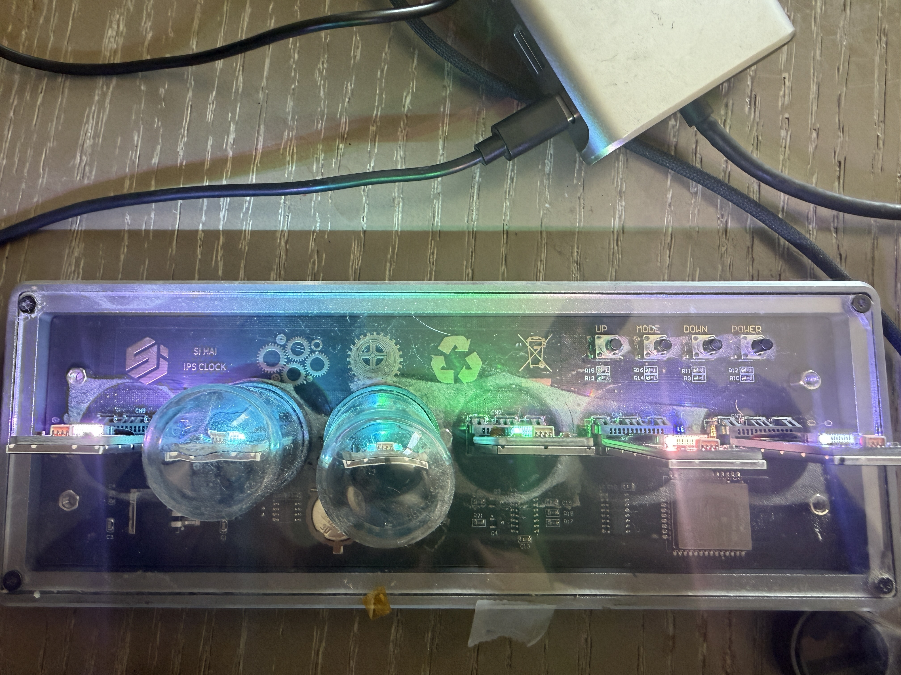
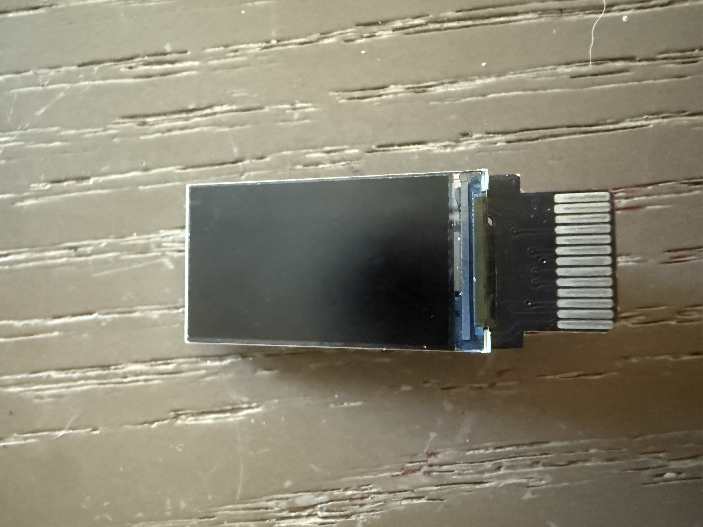
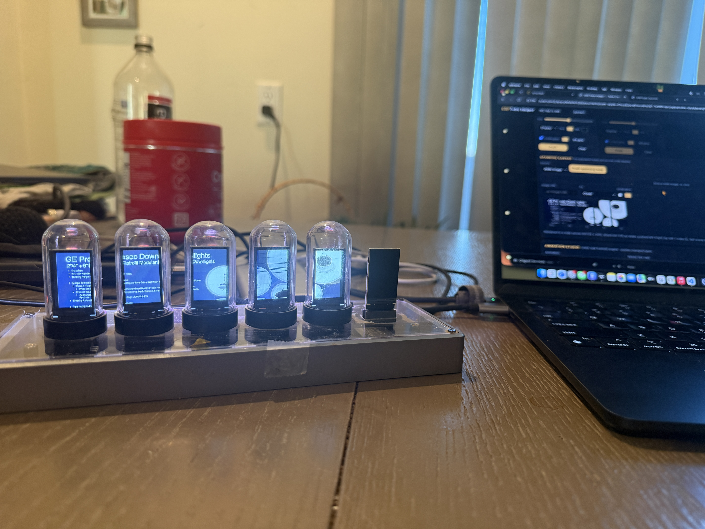

> Code, firmware, docs, and a Chrome web-flasher live at
> [github.com/samstevenm/esptube-clock](https://github.com/samstevenm/esptube-clock) (GPL-3.0).
> This post is the story; the repo is the reference.

## TL;DR

A shelf ornament became a working clock that runs on its own, takes commands over HTTP, looks like a
nixie tube instead of a phone screen pretending to be one, and — the part I did not plan — turned
into a small, honest lesson in how much motion you can push through an ESP32 and a shared SPI bus,
and which old graphics tricks still buy frame rate.

If you only read one section, read [Is it a good platform?](#is-it-a-good-platform).

## The gift

Years ago I was given a "nixie" tube clock — not real nixies, but six little **IPS LCD panels**
tucked inside glass domes, each pretending to be a glowing cathode. Somewhere along the way the
software gave up, one dome shattered, one panel went dark, and the whole thing wouldn't even show up
when I plugged it into my Mac.

I wanted it back as a thing that is *only mine*: no cloud account, no app store, no telemetry. An
ESP32 on my own WiFi doing exactly what I tell it.

## Three facts that made it light up

**1. Power before firmware.** Plugged straight into the Mac: nothing. Through a *powered* USB hub:
alive. The board draws more than a bare laptop port wants to give, and the USB data lines only
behave once it's properly fed. Debug the cable before you debug the code.

**2. It's a clone, and clones differ.** It looked like a well-known EleksTube IPS clock, so I flashed
the community firmware… and got six backlit-but-blank panels. Five times. The breakthrough was a
photograph: the silkscreen reads **"SI HAI IPS CLOCK."** The SI HAI drives its six shared-bus ST7789
panels through a **74HC595 shift register** for chip-select, not one GPIO per panel.

**3. The library was broken on the modern core.** On a current ESP32 Arduino core the stock display
library leaves these panels dark; it needs a patched fork *and* a specific memory offset
(`CGRAM_OFFSET`). Once those three facts lined up, the tubes lit.

## Firmware as a small platform

With the panels talking I wrote firmware from scratch, and made a few choices that turned out to
matter more than the features:

- **Memory-safe by construction.** Every image path streams row by row; there is never a full
  frame in RAM (the ESP32 has 320 KB and no PSRAM — six frames would need 389 KB).
- **Two independent layers.** What the screens show (clock, pushed content) and a live underglow
  effect (rainbow, breathe, comet) that runs *over the top* at the same time.
- **Graceful degradation.** A missing or dead tube stays dark; the clock keeps working. One of mine
  still is.
- **A REST surface a shell script can drive.** Text, images, colours, modes, presets — anything on
  the network can push to any tube.
- **Deterministic boot into a device-native face.** The clock never depends on a browser being open.

## The control surface

The fun part is a single-file **browser console** that turns each tube into a little widget — text,
a picture, weather, a crypto/stock ticker, a clock face, even one tube showing the time, date and a
mini month calendar together. Compose a scene, drag tiles to swap them, save it, cycle a rotation.
Content lives in the browser's IndexedDB at higher fidelity than the tubes can show, and is
downscaled only at push time — the content library is divorced from the device's limits.

In spanning mode you can now **drag a picture across the tubes** with the pointer, zoom with the
wheel, and watch it move on the glass: the browser re-renders the spanning canvas, hashes each
panel, and sends only the panels that changed. There is a **seam-gap** setting so the image stays
continuous across the physical gap between tubes — the first time the software knew the tubes
*have* a physical layout.

## Making it actually look like a nixie

An amber font on a black screen is not a nixie. A nixie is a thin wire numeral glowing orange, with
the *other nine* numerals faintly visible as stacked dark wires behind it, inside warm glass. So the
default face is now built from **pre-rendered plates**:

- Ten digits are rendered offline with the open-licensed **Nixie One** typeface (designed to mimic
  cathode wire), given a tight and a wide bloom, a faint union-of-all-cathodes ghost, and a radial
  lit-glass vignette — as **8-bit intensity maps**, not colour.
- They're run-length packed into flash (~130 KB for eleven plates) and **colorized at draw time**
  through a 256-entry amber lookup table. The table is rebuilt whenever brightness changes, so the
  physical UP/DOWN buttons visibly dim the glow — which they previously did nothing visible for.
- Digit changes **cross-fade**: two plates are decoded pixel-by-pixel and blended over four frames
  (~26 ms each). When several tubes change at once, the frames are interleaved across tubes so a
  rollover reads as one motion rather than a ripple. No frame buffer anywhere — about 2 KB of scratch.

Once the digits were plates, letters were cheap: the set is now **0–9, A–Z and a few symbols**, and
the clock can show a message in nixie glyphs *by itself* — static, flashing, scrolling like an
old ticker, or a countdown that flashes zeros and hands back to the time — with zero pixels sent
from anywhere. A tile that renders its own faces is a tile that needs almost no bandwidth.

I also saw one glitch — a `0` frozen over a `1` for a moment — and rather than guess, wrote a test
that renders **every glyph pair through every fade step** natively (10,580 frames, endpoints
pixel-exact) and walks **all 86,400 times of day** through the same transition logic; the device
got a sweep mode that drives every valid time through the real render path. The logic was clean;
the panel had simply missed one SPI transaction mid-fade, so the fix was a 30 µs chip-select
settle, not a rewrite. Tests first, then opinions.

And a small but important fix: the browser used to push its last scene over the device the moment
it reconnected. Now the device's own face wins by default, and choosing a face — in the browser or
with the physical button — puts the console **hands-off** until you deliberately push again.

## Is it a good platform?

I did a proper audit before answering. The honest version:

- **As a clock and ambient-widget appliance: yes.** Memory-safe streaming, deterministic boot,
  graceful degradation, a clean two-layer model, persistence, a scriptable API.
- **As something to push video into: only just, and only after real work.** When I audited it, the
  console was one 2,000-line file with *seven* separate copies of the render→push path; the firmware
  had no partial-frame write and no streaming transport; and the ESP32 itself tops out around
  **6 fps** for six full panels on its shared SPI bus. A widget tile with a hard ceiling.

That's not a reason to start over. It's a reason to fix the push path and add a real stream before
adding features — and to measure instead of guess. Which is what the rest of this post is.

## Getting motion onto the glass

I took the first step the same day: a **region-blit** endpoint on the clock and **one push path** in
the console that remembers what each tube is showing and sends only the rows that changed. Bytes
halved. Frame rate didn't move — about four tube-updates a second either way — because each push is
an HTTP request to a single-threaded microcontroller and the *request* is the cost, not the pixels.
Measuring it in an afternoon beat theorising about it for a month: the next step was a persistent
stream, not smarter diffing.

So the clock got one: **ESP/1**, a small binary channel — a 20-byte header, a window, a format byte,
a payload, a 4-byte ack — over a plain TCP socket, a WebSocket for the browser, or the USB serial
port. The formats are the tricks old graphics hardware used when there was no overhead to spare:
16-colour palettes with dithering, run-length runs for flat art, and **line doubling** — send every
other row, draw each one twice — which bought +50 % frame rate for free on the wire. The browser
does the encoding itself, so a webcam, a shared tab (that's how a YouTube video reaches the tubes),
a video file or the animation studio streams straight from the page over one WebSocket per tube; a
small Mac bridge does the same for headless sources through ffmpeg.

The honest numbers, on this ESP32 with five live tubes: about **4 fps per tube** for arbitrary
video, 5.5 with line doubling and changed-row bands, 6.3 from the browser's own animations, ~7 for
flat two-colour content. The wire stopped being the limit; the ~25 ms it takes the chip to decode
and push one panel over SPI is. A faster SPI clock gained nothing. DMA crashed the vendored driver.
Sending fewer pixels was the only thing that ever moved the number. The protocol and every
measurement are [written up in the repo](https://github.com/samstevenm/esptube-clock/blob/main/docs/ESP1-PROTOCOL.md).

## Where it landed

It runs the clock. It looks like a nixie. It takes commands over HTTP. It works with no computer at
all. It's documented end to end, open source (GPL-3.0), and there's a Chrome web-flasher so anyone
can un-brick one without a toolchain. A real reverse-engineering slog with a clean ending — and, as I
wrote in my own log that first night, *a thing that's only mine, which was the whole point of making
the time.*

---

*Build notes, the full REST reference, the hardware pinout, and the learnings (including every dead
end) are in the [repo](https://github.com/samstevenm/esptube-clock). The best "everything running at
once" photos live on my own machine — home in frame — so they're not in the public repo.*
